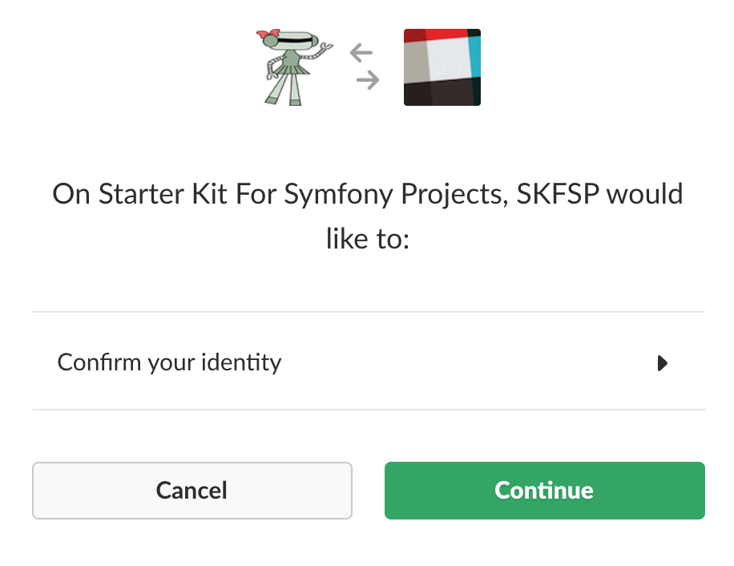

# OAuth WorkFlow

1) Send the user your third party provider with all the necessary scopes. Scopes are used to determine what access your application is asking for.  A lot of OAuth Provider require that you put in the redirect url.  But slack does not and will use the default on in your setting.  For me the url looks like this.  You will need the client id.

``` 
slack.com/oauth/authorize?client_id=276877614980.276992373984&scope=identity.basic,identity.email
```



2) If the user clicks continue the user will send a get request with token in a query param called code.  This will be used to return CredentialTokenModel.  If the user clicks cancel they will be sent to a page that will redirect them to the login page with oauth=start in the query parameter. It will hit the [getCredentials](https://github.com/phptuts/StarterBundleForSymfony/blob/master/Security/Guard/OAuthGuard.php#L81) function which will return null.  Then it will be fed to the [start](https://github.com/phptuts/StarterBundleForSymfony/blob/master/Security/Guard/OAuthGuard.php#L133) function.

3) Then getUser is called which will pass the token to the slack provider.

4) The slack provider will make a request to the api to get an access token.  For slack we get the access token and the user's information.  Because we are not making any more request to slack we don't need to do anything with access token.  The request is made the [SlackClient](https://github.com/phptuts/StarterBundleForSymfony/blob/master/Client/SlackClient.php) which return [OAuthUserModel](https://github.com/phptuts/StarterBundleForSymfony/blob/master/Model/User/OAuthUser.php).  

5) Once we have the [OAuthUserModel](https://github.com/phptuts/StarterBundleForSymfony/blob/master/Model/User/OAuthUser.php) we check to see if a user exists with that slack user id and if so we return it.  If not we check to see if a user exists with that email and if so we save the user slack id with that email.  Finally if all that fails we create a user with the slack user id and the eamil provided with a random password.

6) Then [checkCredentials](https://github.com/phptuts/StarterBundleForSymfony/blob/master/Security/Guard/GuardTrait.php#L41) is called which just returns true.  This is because token was already checked by slack.

7) Then [onAuthenticationSuccess](https://github.com/phptuts/StarterBundleForSymfony/blob/master/Security/Guard/OAuthGuard.php#L97) is call and a page is rendered with the auth_cookie in it.  That page will then redirect the user to the home page.

7 a) If there is an error the user will be directed to [onAuthenticationFailure](https://github.com/phptuts/StarterBundleForSymfony/blob/master/Security/Guard/OAuthGuard.php#L116) which will send them back ot the login page with oauth=fail.


Here are the security settings.  We have to register the provider and firewall.  We have a route registered as well.

[Provider](https://github.com/phptuts/starter-bundle-example/blob/master/app/config/security.yml#L14)

``` 
providers:
    slack:
        id: StarterKit\StartBundle\Security\Provider\SlackProviderInterface

```

[Firewall](https://github.com/phptuts/starter-bundle-example/blob/master/app/config/security.yml#L51):

``` 
slack:
    pattern: ^/oauth/slack*
    stateless: true
    provider: slack
    guard:
        authenticators:
            - StarterKit\StartBundle\Security\Guard\OAuthGuardInterface

```

[Controller Method](https://github.com/phptuts/StarterBundleForSymfony/blob/master/Controller/SecurityController.php#L40) For Oauth:

``` 
/**
 * @Security("has_role('ROLE_USER')")
 * @Route(path="/oauth/{provider}", name="_api_doc_oauth", methods={"GET"})
 */
public function oauthAction()
{
    throw new \LogicException("Should never hit this end point symfony should take this over.");
}
```
